# Benchmarking Workflow of LCR Detection Tools

A pipeline for running multiple Low Complexity Region (LCR) detection tools on a proteome, converting their outputs to a common BED format, and generating comparative figures (Fig 1–Fig 8) that benchmark tool performance, motif composition, entropy/purity, overlap, and agreement against a reference (windowed and DisProt/SIFTS-derived) definition of LCRs.

Example organism used throughout: `ecoli`.


---

## Table of Contents

- [1. Overview](#1-overview)
- [2. Folder Structure](#2-folder-structure)
- [3. Naming Conventions](#3-naming-conventions)
- [4. Prerequisites](#4-prerequisites)
- [5. Step 1 — Run LCR Detection Tools](#5-step-1--run-lcr-detection-tools)
- [6. Step 2 — Convert Tool Outputs to BED (`converter_to_bed`)](#6-step-2--convert-tool-outputs-to-bed-converter_to_bed)
- [7. Step 3 — Figure 1: Length, Coverage, Count, AA Composition, Entropy](#7-step-3--figure-1-length-coverage-count-aa-composition-entropy)
- [8. Step 4 — Figure 2: Consensus Regions & Motifs](#8-step-4--figure-2-consensus-regions--motifs)
- [9. Step 5 — Figure 3: Purity Across Tools](#9-step-5--figure-3-purity-across-tools)
- [10. Step 6 — Figure 4: Pairwise Tool Overlap (Jaccard)](#10-step-6--figure-4-pairwise-tool-overlap-jaccard)
- [11. Step 7 — Figure 5: Mutation Metrics](#11-step-7--figure-5-mutation-metrics)
- [12. Step 8 — Figure 6: Windowed Reference Classification & TPR/FPR](#12-step-8--figure-6-windowed-reference-classification--tprfpr)
- [13. Step 9 — Figure 7: TPR/FPR Summary Bar Plots](#13-step-9--figure-7-tprfpr-summary-bar-plots)
- [14. Step 10 — Figure 8: DisProt & Missing-Residue (SIFTS) Complexity](#14-step-10--figure-8-disprot--missing-residue-sifts-complexity)
- [15. Notes & Assumptions](#15-notes--assumptions)

---

## 1. Overview

The workflow has two parts:

1. **Command-line tools** — run 8 LCR detection tools (13 total configurations) on a proteome FASTA file to produce raw LCR predictions in each tool's native format.
2. **Python pipeline** — convert every tool's output to a common 1-based BED format, then run a series of scripts organized by figure (`Fig1` … `Fig8`) that compute statistics and render the corresponding plots.

Some steps in Fig 2–Fig 6 currently rely on command-line utilities (`bedtools`, small bash scripts) rather than pure Python — these are documented as-is below.
---

## 2. Folder Structure

```
<organism>/                          e.g. ecoli/
├── <organism>.fasta                 e.g. ecoli.fasta
├── <organism>_cleaned.fasta         cleaned FASTA (UniProt ID as header)
├── lcrbytools/                      raw output of all 8 tools / 13 configs
├── bed_<organism>/                  BED files (1-based) converted from lcrbytools
├── bed_bedtools_<organism>/         BED files made BEDTools-compatible (0-based)
├── dataforFig1/
│   ├── extracted_sequences/
│   ├── protein_lengths.tsv
│   ├── LCR_Length/
│   ├── LCR_Count/
│   ├── ShanonEntropy/
│   ├── LCR_Coverage/
│   └── Amino_acid/
├── dataforFig2/
│   ├── multiinter.tsv
│   ├── 02_consensus_beds/
│   ├── 03_consensus_fastas/
│   ├── 04_substring_motifs/
│   ├── 05_filtered/
│   ├── 06_peptide_counts/
│   ├── 07_motif_list/
│   ├── entropy/
│   └── purity/
├── dataforFig3/
│   ├── 01_fastas/
│   └── 02_metrics/
├── dataforFig4/
│   └── jaccard_matrix.tsv
├── dataforFig5/
│   └── 02_metrics/
├── dataforFig6/
│   ├── ecoli_windows.bed
│   ├── ecoli_windows_out.tsv
│   ├── ecoli_windows_classified.tsv
│   ├── ecoli_windows_real.bed
│   ├── protein_confusion.tsv
│   ├── reference_metrics.tsv
│   └── plot_tables/
├── dataforFig7/
│   ├── Coverage_summary.tsv
│   ├── Entropy_ratio_summary.tsv
│   ├── Gene_length_summary.tsv
│   └── Lcr_count_summary.tsv
├── dataforFig8/
│   ├── ecoli_sifts_observed.tsv
│   ├── fig8A_disprot_complexity.tsv
│   ├── ecoli_missing_residues.bed
│   ├── ecoli_missing_residues.fa
│   └── fig8B_missing_residue_complexity.tsv
└── Fig_outputs/
    ├── Fig1/ … Fig8/                final PNG figures
```

---

## 3. Naming Conventions

**Proteome FASTA:** `organism.fasta` (e.g. `ecoli.fasta`)

**Raw tool outputs in `lcrbytools/`:** `toolname_mode_organism.{fa|tsv|out|html}`

| File | Tool / Mode |
|---|---|
| `xstream_m1_ecoli.html` | XSTREAM, mode 1 |
| `flps_default_ecoli.out` | fLPS, default |
| `flps_strict_ecoli.out` | fLPS, strict |
| `flps2_default_ecoli.out` | fLPS2, default |
| `flps2_strict_ecoli.out` | fLPS2, strict |
| `seg_ecoli.fa` | SEG, default |
| `seg_intermediate_ecoli.fa` | SEG, intermediate |
| `seg_strict_ecoli.fa` | SEG, strict |
| `alcor_mode1_masked_ecoli.fa` | AlcoR, mode 1 |
| `alcor_mode2_masked_ecoli.fa` | AlcoR, mode 2 |
| `Treks_clustalw_ecoli.tsv` | T-Reks (ClustalW) |
| `lcrfinder_ecoli.bed` | LCR-Finder (pre-converted, via MATLAB) |

**BED files:** 1-based, no header, 3 columns:

```
A7LPI0	304	322
```

---

## 4. Prerequisites

- **Tools:** BLAST+ (`segmasker`), fLPS, fLPS2, AlcoR, XSTREAM (`xstream.jar`), T-ReksHPC (`T-ReksHPC_0.1-SNAPSHOT.jar`), ClustalW, `bedtools`, Java, MATLAB (for LCR-Finder only).
- **Python packages:** `pandas`, `numpy`, `biopython`, `matplotlib`/`seaborn`, `Pillow` (for combined figures).
- **OS:** command-line tool invocations below assume a Linux/Ubuntu shell; conversion/analysis scripts are Python and cross-platform (paths shown as Windows-style `r"ecoli\..."` in the original scripts — adjust separators for your OS).

---

## 5. Step 1 — Run LCR Detection Tools

Run each tool against the proteome FASTA (example: `arabidopsis.fasta`) to produce the 13 raw output configurations.

### 5.1 SEG — default
```bash
segmasker \
-in arabidopsis.fasta \
-window 12 \
-locut 2.2 \
-hicut 2.5 \
-out arabidopsis_seg.fa \
-outfmt fasta
```

### 5.2 SEG — intermediate
```bash
segmasker \
-in arabidopsis.fasta \
-window 15 \
-locut 1.9 \
-hicut 2.5 \
-out arabidopsis_seg_intermediate.fa \
-outfmt fasta
```

### 5.3 SEG — strict
```bash
segmasker \
-in arabidopsis.fasta \
-window 15 \
-locut 1.5 \
-hicut 1.8 \
-out arabidopsis_seg_strict.fa \
-outfmt fasta
```

### 5.4 fLPS — default
```bash
~/Lcr_Project/tools/flps/flps/fLPS/bin/linux/fLPS \
arabidopsis.fasta \
> flps_default.out
```

### 5.5 fLPS — strict
```bash
~/Lcr_Project/tools/flps/flps/fLPS/bin/linux/fLPS \
arabidopsis.fasta \
> flps_strict.out
```

### 5.6 fLPS2 — default
```bash
~/Lcr_Project/tools/flps2/fLPS2programs/src/fLPS2 \
arabidopsis.fasta \
> flps2_default.out
```

### 5.7 fLPS2 — strict
```bash
~/Lcr_Project/tools/flps2/fLPS2programs/src/fLPS2 \
-m 5 \
-M 25 \
-t 1e-5 \
arabidopsis.fasta \
> flps2_strict.out
```

### 5.8 AlcoR — mode 1
```bash
~/Lcr_Project/tools/alcor/alcor/bin/AlcoR mapper \
-v \
-m 5:20:0:0:10:0.9/3:10:0.9 \
-w 5 \
-k \
-o arabido_alcor_mode1_masked.fa \
arabidopsis.fasta
```

### 5.9 AlcoR — mode 2
```bash
~/Lcr_Project/tools/alcor/alcor/bin/AlcoR mapper \
-v \
-m 5:10:0:0:10:0.9/1:1:0.9 \
-w 5 \
-k \
-o arabido_alcor_mode2_masked.fa \
arabidopsis.fasta
```

### 5.10 XSTREAM — modes 1–5
```bash
# mode 1
java -jar ~/Lcr_Project/tools/XSTREAM/xstream.jar arabidopsis.fasta -m1 -a_m1

# mode 2
java -jar ~/Lcr_Project/tools/XSTREAM/xstream.jar arabidopsis.fasta -m2 -a_m2

# mode 3
java -jar ~/Lcr_Project/tools/XSTREAM/xstream.jar arabidopsis.fasta -m3 -a_m3

# mode 4
java -jar ~/Lcr_Project/tools/XSTREAM/xstream.jar arabidopsis.fasta -m4 -a_m4

# mode 5
java -jar ~/Lcr_Project/tools/XSTREAM/xstream.jar arabidopsis.fasta -m5 -a_m5
```
XSTREAM produces 3 HTML files per mode (suffixes `out_1`, `out_2`, `out_3`); the converter uses the `_out_2.html` file.

### 5.11 T-Reks (ClustalW)
```bash
java -Xmx4G \
-jar ~/Lcr_Project/tools/treks-hpc/target/T-ReksHPC_0.1-SNAPSHOT.jar \
-f arabidopsis.fasta \
-t arabido_treks_clustalw.tsv \
-a arabido_treks_clustalw.aln \
-c /usr/bin/clustalw
```


### 5.12 LCR-Finder
LCR-Finder runs protein-by-protein and produces thousands of files for a whole proteome. A MATLAB script consolidates these into a single BED file (`lcrfinder_ecoli.bed`). This BED file is assumed to already exist as an input to the pipeline — LCR-Finder itself is not automated here.

---

---

## 6. Step 2 — Convert Tool Outputs to BED (`converter_to_bed`)

Scripts in this folder convert each tool's native output into the common 1-based BED format described in [Section 3](#3-naming-conventions). Output files share the same base name as the input, with a `.bed` extension.

### `Convert_seg_alcor.py`
SEG and AlcoR output masked FASTA (LCR sequence in lowercase). This script scans for lowercase runs and reports their coordinates as BED. Converts 5 files:
- `seg_ecoli.fa`
- `seg_intermediate_ecoli.fa`
- `seg_strict_ecoli.fa`
- `alcor_mode1_masked_ecoli.fa`
- `alcor_mode2_masked_ecoli.fa`

### `convert_flps.py`
Converts fLPS/fLPS2 `.out` files, e.g.:
```
tr|A0A067XG43|A0A067XG43_CAEEL	SINGLE	1	16	250	33	5.153e-08	{I}
```
Handles 4 files: `flps_default_ecoli.out`, `flps_strict_ecoli.out`, `flps2_default_ecoli.out`, `flps2_strict_ecoli.out`.

### `convert_treks.py`
Converts the T-Reks/ClustalW `.tsv` output, e.g.:
```
seqid	repnumber	replength	start	end	psim	totlength
sp|A0A0K3AUE4|SEA2_CAEEL	12	3	981	1015	0.72	35
```

### `convert_xstream.py`
Converts the XSTREAM `_out_2.html` file to BED.

### `convert_dotplot.py` (optional)
Converts an optional dot-plot–style amino-acid composition file (used only when this data is separately available, e.g. from a published dataset) to BED. Example input format:
```
D  K  I  Y  G  R  M  E  L  W  P  F  H  T  N  A  C  V  S  Q  parent  sequence  length  LCR  Species
```

---

## 7. Step 3 — Figure 1: Length, Coverage, Count, AA Composition, Entropy

All scripts in this section live in the `Fig1` folder and run in sequence.

### `Run_pipeline_1.py`
Takes the FASTA file and the BED folder, creates `dataforFig1/extracted_sequences/` and `dataforFig1/protein_lengths.tsv`. Handles multiple FASTA header alias formats.

```
FASTA_FILE = r"ecoli\ecoli.fasta"
BED_FOLDER = r"ecoli\bed_ecoli"
OUTPUT_DIR = r"ecoli\dataforFig1"
```

`protein_lengths.tsv`:
```
Protein_ID	Protein_Length
A5A616	31
```

Per-tool extracted sequence files, named `toolname_organism_lcrs.tsv` (e.g. `alcor_mode1_masked_ecoli_lcrs.tsv`):
```
Protein_ID	Start	End	Length	Protein_Length	Sequence
P00888	94	112	19	356	VYFEKPRTTVGWKGLINDP
```

### `gen_len_counts_2.py`
Takes `extracted_sequences/`, produces `LCR_Length/` and `LCR_Count/` (one file per tool/config — 13 total in each).

```
INPUT_DIR = r"ecoli\dataforFig1\extracted_sequences"
LENGTH_DIR = r"ecoli\dataforFig1\LCR_Length"
COUNT_DIR  = r"ecoli\dataforFig1\LCR_Count"
```

`LCR_Length` format:
```
Category	Count
0-10	23
10-20	472
20-50	255
50-100	46
100-200	22
200+	44
```

`LCR_Count` format:
```
Category	Count
0	4026
1-5	344
6-10	26
11-15	5
16+	2
```

### `Gen_diversity_3.py`
Takes `extracted_sequences/`, produces `ShanonEntropy/` — one file per tool, named `toolname_organism_SNS`.

```
INPUT_DIR = r"ecoli\dataforFig1\extracted_sequences"
OUTPUT_DIR = r"ecoli\dataforFig1\ShanonEntropy"
```

Format (e.g. `alcor_mode1_masked_ecoli_SNS`):
```
Shannon_Entropy
3.7216117239699003
```

### `Gen_coverage_4.py`
Takes `extracted_sequences/`, `protein_lengths.tsv`, and the FASTA file; produces `LCR_Coverage/` (one file per tool, `tool_organism_categorized.tsv`).

```
EXTRACT_DIR = r"ecoli\dataforFig1\extracted_sequences"
PROTEIN_LENGTHS = r"ecoli\dataforFig1\protein_lengths.tsv"
OUTPUT_DIR = r"ecoli\dataforFig1\LCR_Coverage"
FASTA_FILE = r"ecoli\ecoli.fasta"
```

Format (e.g. `alcor_mode1_masked_ecoli_categorized.tsv`):
```
Category	Count
0-20	4231
20-40	46
40-60	29
60-80	18
80-100	79
```

### `Aa_composition.py`
Takes `extracted_sequences/`, produces `Amino_acid/` (one file per tool).

```
INPUT_DIR = r"ecoli\dataforFig1\extracted_sequences"
OUTPUT_DIR = r"ecoli\dataforFig1\Amino_acid"
```

Format:
```
Character	Count	Proportion
A	3205	0.08719664816628578
```

### Plotting scripts

| Script | Input | Output |
|---|---|---|
| `fig1A_length_hm.py` | `LCR_Length/` | Fig1A — LCR length distribution (heatmap) |
| `fig1B_coverage_hm.py` | `LCR_Coverage/` | Fig1B — LCR coverage distribution (heatmap) |
| `fig1C_count_dist.py` | `LCR_Count/` | Fig1C — LCRs per protein (stacked bar) |
| `fig1D_aa_comp.py` | `Amino_acid/` | Fig1D — amino acid composition |
| `fig1E_entropybox.py` | `ShanonEntropy/` | Fig1E — Shannon entropy distribution (boxplot) |

All output to `ecoli\Fig_outputs\Fig1`.

### `Comb_fig1.py`
Combines Fig1A–1E PNGs into a single composite image. Should be exposed as a **user option** ("combined" vs. "individual" figures) in the final report rather than run unconditionally.

```python
A = Image.open(r"ecoli\Fig_outputs\Fig1\Figure1A_Length_Heatmap.png")
B = Image.open(r"ecoli\Fig_outputs\Fig1\Figure1B_Coverage_Heatmap.png")
C = Image.open(r"ecoli\Fig_outputs\Fig1\Figure1C_CountDistribution.png")
D = Image.open(r"ecoli\Fig_outputs\Fig1\Figure1D_AminoAcidComposition.png")
E = Image.open(r"ecoli\Fig_outputs\Fig1\Figure1E_Entropy_Boxplot.png")
```

---

## 8. Step 4 — Figure 2: Consensus Regions & Motifs

Some steps here currently use command-line utilities (`bedtools`, bash) rather than Python — flagged below as **[CLI]**. These are candidates for porting into the pipeline.

### `00_prepare_bedfiles.py`
Converts `bed_ecoli/` into BEDTools-compatible format (0-based, drops length-1 LCRs) → `bed_bedtools_Ecoli/`.

```
INPUT_DIR = Path(r"ecoli\bed_ecoli")
OUTPUT_DIR = Path(r"ecoli\bed_bedtools_Ecoli")
```

### `01_cleanfasta_headers.py`
Cleans proteome FASTA headers down to the UniProt ID only. All later steps use this cleaned FASTA.

```
INPUT_FASTA = r"ecoli\ecoli.fasta"
OUTPUT_FASTA = r"ecoli\ecoli_cleaned.fasta"
```

Cleaned format:
```
>A0A2R8S035
MAVCIAVIAKENYPLYIRSVPTQGELKFHYTVHTSLDVVEEKISGVGKALADQRELYLGL...
```

### **[CLI]** `bedtools multiinter`
```bash
bedtools multiinter \
-i bed_bedtools_ecoli/*.bed \
> dataforFig2/multiinter.tsv
```
Format:
```
4EB3L	88	103	1	3	0	0	1	0	0	0	0	0	0	0	0	0	0
```

### `02_consensus_beds_1.py`
Takes `multiinter.tsv`, produces `02_consensus_beds/` with per-consensus-level BED files and `consensus_summary.tsv`. Number of consensus files depends on the maximum number of tools that agree on any region (e.g. with 13 tools, if no region is called by all 13, only up to 12 consensus files are produced).

```
INPUT_FILE = Path(r"ecoli\multiinter.tsv")
OUTPUT_DIR = Path(r"ecoli\dataforFig2\02_consensus_beds")
```

### **[CLI]** `extract_sequences.sh` (bash, uses `bedtools getfasta`)
Takes `ecoli_cleaned.fasta` + `02_consensus_beds/`, produces `03_consensus_fastas/`.

Format:
```
>::A0A385XJ53:0-2
MA
```

### `04_substring_motifs.py`
Takes `03_consensus_fastas/`, produces `04_substring_motifs/` (same file count as input).

```
INPUT_DIR = Path(r"ecoli\dataforFig2\03_consensus_fastas")
OUTPUT_DIR = Path(r"ecoli\dataforFig2\04_substring_motifs")
```

Format (`consensus_1_substring.tsv`):
```
Protein	Start	End	Mono-peptide	Mono-Coverage	Di-peptide	Di-Coverage	Tri-peptide	Tri-Coverage
:A0A385XJ53	0	2	M	0.500000	MA	1.000000	-	0.000000
```

### `05_subfilter.py`
```
INPUT_DIR = Path(r"ecoli\dataforFig2\04_substring_motifs")
OUTPUT_DIR = Path(r"ecoli\dataforFig2\05_filtered")
```
Format (`consensus_1_filtered.tsv`):
```
Protein	Start	End	Best-Type	Best-Peptide	Best-Coverage
:A0A385XJ53	0	2	Di	MA	1.0
```

### `06_peptide_counts.py`
```
INPUT_DIR = Path(r"ecoli\dataforFig2\05_filtered")
OUTPUT_DIR = Path(r"ecoli\dataforFig2\06_peptide_counts")
```
Format (`consensus_1_peptide_counts.tsv`):
```
Best-Peptide	Best-Type	Count	Proportion
L	Mono	1207	0.17282359679266895
```

### `07_motif_list.py` *(optional — not used for figure generation)*
```
INPUT_DIR = Path(r"ecoli\dataforFig2\06_peptide_counts")
OUTPUT_DIR = Path(r"ecoli\dataforFig2\07_motif_list")
```
Format (`motifs.tsv`):
```
Motif	Consensus_1	Consensus_2	...	Consensus_11	Total
L	1207	1392	914	553	192	64	42	5	0	0	0	4369
```

### `entropy.py`
```
INPUT_DIR = Path(r"ecoli\dataforFig2\03_consensus_fastas")
OUTPUT_DIR = Path(r"ecoli\dataforFig2\entropy")
```
Format (`entropy.tsv`):
```
Consensus	Sequence	Length	Entropy
1	::A0A385XJ53:0-2	2	1.0
```

### `purity.py`
```
INPUT_DIR = Path(r"ecoli\dataforFig2\03_consensus_fastas")
OUTPUT_DIR = Path(r"ecoli\dataforFig2\purity")
```
Format (`purity.tsv`):
```
Consensus	Sequence	Length	Purity
1	::A0A385XJ53:0-2	2	0.5
```

### Plotting scripts

| Script | Input | Output |
|---|---|---|
| `fig2a.py` | `06_peptide_counts/` | Fig2A — top peptide motifs across consensus levels |
| `fig2b.py` | `entropy.tsv` | Fig2B — entropy plot |
| `fig2c.py` | `purity.tsv` | Fig2C — purity plot |

All output to `ecoli\Fig_outputs\Fig2`.

---

## 9. Step 5 — Figure 3: Purity Across Tools

### **[CLI]** `makefastas.sh` (bash)
Takes `bed_bedtools_ecoli/` + `ecoli_cleaned.fasta`, maps BED coordinates to sequence, produces `01_fastas/` inside `dataforFig3/`.

Format (`flps_default_ecoli.fa`):
```
>::A0A0A7EPL0:621-634
IAHPQTLPVNYRG
```

### `Purity_calculation.py`
```
INPUT_DIR = Path(r"ecoli\dataforFig3\01_fastas")
OUTPUT_DIR = Path(r"ecoli\dataforFig3\02_metrics")
```
Format (`flps_default_ecoli_purity.tsv`):
```
Protein	Start	End	Length	Most_Common_AA	AA_Count	Purity
::A0A0A7EPL0	0	847	847	P	79	0.09327036599763873
```

### `fig3_plot.py`
Takes `02_metrics/`, produces Fig3 — purity detection across LCR detection methods → `ecoli\Fig_outputs\Fig3`.

---

## 10. Step 6 — Figure 4: Pairwise Tool Overlap (Jaccard)

### **[CLI]** `jaccardsimilarity.sh` (bash)
Takes `bed_bedtools_ecoli/`, produces `jaccard_matrix.tsv` (pairwise similarity matrix) → `dataforFig4/`.

### `Fig4_plot.py`
Takes `jaccard_matrix.tsv`, produces Fig4 — pairwise overlap among LCR detection methods (heatmap) → `ecoli\Fig_outputs\Fig4`.

---

## 11. Step 7 — Figure 5: Mutation Metrics

### `mutation_metrices.py`
Takes `01_fastas/` (from `dataforFig3`, produced by `makefastas.sh`), produces `dataforFig5/02_metrics/` — one file per tool, `tool_organism_metrics.tsv`.

Format (`flps_default_metrics.tsv`):
```
Protein	Start	End	Length	Entropy	Most_Common_AA	Most_Common_AA_Percent	Best_Model	Mutation_Percent
::A0A0A7EPL0	621	634	13	3.5466	P	15.38	6	53.85
```

### `fig5_hm.py`
Takes `dataforFig5/02_metrics/`, produces a per-tool heatmap PNG → `ecoli\Fig_outputs\Fig5`.

### `Fig5_combined.py`
Combines the individual Fig5 heatmaps into one composite image. Expose as a **user checkbox** (combined vs. individual), not run unconditionally.

---

## 12. Step 8 — Figure 6: Windowed Reference Classification & TPR/FPR

### `seq_parser.py`
Splits the proteome into sliding windows (window size 20, step 10), produces `ecoli_windows.bed`.
```
input_fasta = r"ecoli\ecoli_cleaned.fasta"
output_bed = r"ecoli\dataforFig6\ecoli_windows.bed"
```

### `02_complexity_plot.py`
Computes per-window complexity metrics → `ecoli_windows_out.tsv`.
```
fasta_file = r"ecoli\ecoli_cleaned.fasta"
bed_file = r"ecoli\dataforFig6\ecoli_windows.bed"
output_file = r"ecoli\dataforFig6\ecoli_windows_out.tsv"
```
Format:
```
Protein_ID	Start	End	Entropy	Most_Frequent_AA	Most_Frequent_AA_Percent	Kmers_At_Least_Twice	Best_Kmer	Mutation_Percent	Kmer_Mutation_List	Sequence
A0A0A7EPL0	1	20	3.5219	F	20.00	A,T,R,F,E,EF	F	80.00	A:90.00,T:90.00,R:90.00,F:80.00,E:90.00,EF:80.00	MVIPATSRFGFRAEFNTKEF
```

### `03_classification.py`
```
input_file = r"ecoli\dataforFig6\ecoli_windows_out.tsv"
output_file = r"ecoli\dataforFig6\ecoli_windows_classified.tsv"
```
Format:
```
Protein_ID	Start	End	Most_Frequent_AA_Percent	Mutation_Percent	Classification
A0A0A7EPL0	1	20	20.0	80.0	HCR
```

### `04_annotate.py`
Annotates windows into 3 categories: **HCR**, **LCR**, **CBR**.
```
input_file = r"ecoli\dataforFig6\ecoli_windows_classified.tsv"
output_file = r"ecoli\dataforFig6\ecoli_windows_real.bed"
```
Format:
```
Protein_ID	Start_Position	End_Position	Classification
A0A0A7EPL0	1	847	HCR
```

### `Protein_confusion.py`
Compares each tool's calls against the reference classification, producing a TP/FP/FN/TN table per protein per tool.
```
proteome_fasta = r"ecoli\ecoli_cleaned.fasta"
reference_bed = r"ecoli\dataforFig6\ecoli_windows_real.bed"
tool_folder = r"ecoli\bed_bedtools_Ecoli"
output_file = r"ecoli\dataforFig6\protein_confusion.tsv"
```
Format:
```
Protein_ID	Tool	TP	FP	FN	TN
A0A0A7EPL0	alcor_mode1_masked_arabidopsis	0	30	0	817
```

### `references_metrices.py`
```
reference_bed = r"ecoli\dataforFig6\ecoli_windows_real.bed"
proteome_fasta = r"ecoli\ecoli_cleaned.fasta"
output_file = r"ecoli\dataforFig6\reference_metrics.tsv"
```
Format:
```
Protein_ID	Protein_Length	LCR_Count	Coverage_Percent	Entropy_Ratio	Length_Bin	Count_Bin	Coverage_Bin	Entropy_Bin
F4J6P6	515	0	0.0	0.0	8	0	5	0.2
```

### `Tpr_fpr.py`
Combines `reference_metrics.tsv` + `protein_confusion.tsv` into 8 TPR/FPR tables under `plot_tables/`:

- `Coverage_fpr.tsv`, `Coverage_tpr.tsv`
- `Entropy_ratio_fpr.tsv`, `Entropy_ratio_tpr.tsv`
- `Genelength_fpr.tsv`, `Genelenght_tpr.tsv`
- `Lcr_count_fpr.tsv`, `Lcr_count_tpr.tsv`

```
metrics_file = r"ecoli\dataforFig6\reference_metrics.tsv"
confusion_file = r"ecoli\dataforFig6\protein_confusion.tsv"
output_dir = r"ecoli\dataforFig6\plot_tables"
```
Format:
```
Tool	Category	FPR
alcor_mode1_masked_arabidopsis	10	0.29363429926537826
```

### `Plot_fig6.py`
Produces 4 PNGs from `plot_tables/`: `Fig6A_Genelength.png`, `Fig6B_LCRCount.png`, `Fig6C_Coverage.png`, `Fig6D_EntropyRatio.png`.
```
input_dir = Path(r"ecoli\dataforFig6\plot_tables")
output_dir = Path(r"ecoli\Fig_outputs\Fig6")
```

### `Fig6_combined.py`
Combines the 4 Fig6 plots into one image. Expose as a **user checkbox** (combined vs. individual).
```
input_dir = Path(r"ecoli\dataforFig6\plot_tables")
output_dir = Path(r"ecoli\Fig_outputs\Fig6")
```

---

## 13. Step 9 — Figure 7: TPR/FPR Summary Bar Plots

### `buildsum.py`
Aggregates `dataforFig6/plot_tables/` into 4 summary TSVs in `dataforFig7/`: `Coverage_summary.tsv`, `Entropy_ratio_summary.tsv`, `Gene_length_summary.tsv`, `Lcr_count_summary.tsv`.
```
input_dir = Path(r"ecoli\dataforFig6\plot_tables")
output_dir = Path(r"ecoli\dataforFig7")
```
Format:
```
Tool	TPR	FPR
alcor_mode1_masked_arabidopsis	0.33323696205475234	0.31341151535875283
```

### `Plot_fig7.py`
Takes the 4 summary TSVs, produces a single PNG with 4 bar plots → `ecoli\Fig_outputs\Fig7`.

---

## 14. Step 10 — Figure 8: DisProt & Missing-Residue (SIFTS) Complexity

### `00_filter_sifts.py`
Takes the cleaned FASTA and a SIFTS `uniprot_segments_observed.tsv` file, produces `ecoli_sifts_observed.tsv`.

> SIFTS/proteome data download example:
> ```bash
> wget "https://rest.uniprot.org/uniprotkb/stream?format=fasta&query=(proteome:UP000006548)" -O AT_proteome.fasta
> ```

```
proteome_fasta = r"ecoli\ecoli_cleaned.fasta"
sifts_file = r"uniprot_segments_observed.tsv"
output_file = r"ecoli\dataforFig8\ecoli_sifts_observed.tsv"
```
Format:
```
PDB	CHAIN	SP_PRIMARY	RES_BEG	RES_END	PDB_BEG	PDB_END	SP_BEG	SP_END
10ep	A	Q8VZF3	47	633	108	695	109	694
```

### `01_disprot_comp.py`
Takes `Disprot_ecoli.tsv` (pre-filtered by organism taxonomy from the full DisProt download — **currently a manual step; automate via Python for the pipeline**), produces `fig8A_disprot_complexity.tsv` + a log file (log not used for plotting).
```
input_file = r"ecoli\dataforFig8\Disprot_ecoli.tsv"
output_file = r"ecoli\dataforFig8\fig8A_disprot_complexity.tsv"
log_file = r"ecoli\dataforFig8\fig8A_disprot_complexity.log"
```
Format:
```
Protein_ID	Region_ID	Experimental_Method	Mutation_Percent	Most_Frequent_AA_Percent
Q9SQZ9	DP00434r001	nuclear magnetic resonance spectroscopy evidence used in manual assertion	63.63636363636363	27.27272727272727
```

### `02_infer_missing_residues.py`
Takes `protein_lengths.tsv` (from `dataforFig1`) + `ecoli_sifts_observed.tsv`, infers residues missing from structural data, produces `ecoli_missing_residues.bed`.
```
protein_lengths = r"ecoli\dataforFig1\protein_lengths.tsv"
observed_file = r"ecoli\dataforFig8\ecoli_sifts_observed.tsv"
output_bed = r"ecoli\dataforFig8\ecoli_missing_residues.bed"
```

### `03_extract_missing_sequences.py`
```
fasta_file = r"ecoli\ecoli_cleaned.fasta"
bed_file = r"ecoli\dataforFig8\ecoli_missing_residues.bed"
output_fasta = r"ecoli\dataforFig8\ecoli_missing_residues.fa"
log_file = r"ecoli\dataforFig8\extract_missing_sequences.log"
```
Only the `.fa` output is used downstream; the log is for verification.

### `04_missing_complexity.py`
```
input_fasta = r"ecoli\dataforFig8\ecoli_missing_residues.fa"
output_file = r"ecoli\dataforFig8\fig8B_missing_residue_complexity.tsv"
log_file = r"ecoli\dataforFig8\fig8B_missing_complexity.log"
```
Format:
```
Protein_ID	Start	End	Length	Mutation_Percent	Most_Frequent_AA_Percent
Q8VZF3	1	108	108	80.55555555555556	19.444444444444446
```

### Plotting scripts

| Script | Input | Output |
|---|---|---|
| `plot_fig8A.py` | `fig8A_disprot_complexity.tsv` | Fig8A |
| `plot_fig8B.py` | `fig8B_missing_residue_complexity.tsv` | Fig8B |

Both output to `ecoli\Fig_outputs\Fig8`.

---

## 15. Notes & Assumptions

- **LCR-Finder** is run outside this pipeline (per-protein output consolidated via a separate MATLAB script); its final BED file is treated as a pre-existing input.
- **Dot-plot data** (`convert_dotplot.py`) is optional and only relevant when externally sourced composition data (e.g. from a published dataset) is available for a given organism — not all organisms will have this.
- **DisProt filtering by taxonomy** (`Disprot_ecoli.tsv` used in `01_disprot_comp.py`) is currently a manual pre-filtering step from the full DisProt download and should be automated in Python for full pipeline reproducibility.
- Several bash/CLI steps (`bedtools multiinter`, `extract_sequences.sh`, `makefastas.sh`, `jaccardsimilarity.sh`) are documented as run manually on Ubuntu; porting these into Python (e.g. via `pybedtools` or `subprocess` wrappers) is a planned follow-up so the full workflow can run end-to-end from a single entry point.
- **Combined vs. individual figures**: for Fig1, Fig5, and Fig6, a combined composite PNG can be generated in addition to the individual panel PNGs. This should be a **user-selectable option** in the final report (checkbox: combined / individual), not a step that always runs.
- File paths throughout are shown as given in the original scripts (Windows-style `r"ecoli\..."`); adjust path separators for your OS as needed.
- `07_motif_list.py` (Fig 2) and the `.log` outputs in Fig 8 are informational only and are not required for figure generation — safe to skip if optimizing for speed.
